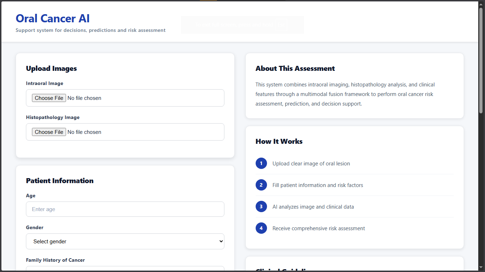
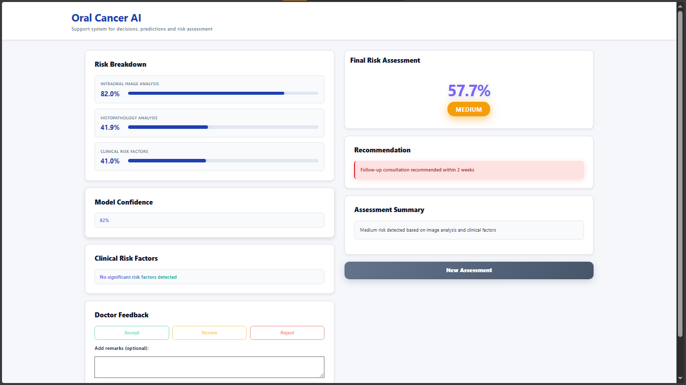

<div align="center">

# 🦷 Oral Cancer AI

### Multimodal AI Decision Support for Early Oral Cancer Detection

> *"From Pixels to Prognosis — empowering clinicians with explainable AI."*

[](https://www.python.org/)
[](https://pytorch.org/)
[](https://flask.palletsprojects.com/)
[](https://arxiv.org/abs/1512.03385)
[](LICENSE)

</div>

---

## 📌 Overview

**Oral Cancer AI** is an end-to-end clinical decision support system that fuses **deep-learning image analysis** with **patient risk factors** to produce a calibrated, explainable risk score for oral cancer.

It runs **two ResNet-18 models in parallel** — one trained on **intraoral photographs**, the other on **histopathology slides** — and combines their outputs with a clinical risk vector (age, tobacco, lifestyle, symptoms) to deliver a single fused **risk percentage**, a triage **recommendation**, and a **Grad-CAM heatmap** that highlights the regions driving the prediction.

Built originally for a hackathon, this project demonstrates a multimodal fusion pipeline suitable for assistive screening in low-resource clinical settings.

---

## 🖼️ Screenshots

<div align="center">

### 🩺 Patient Intake & Image Upload


<br/><br/>

### 📊 Risk Assessment Report


</div>

---

## ✨ Key Features

| 🚀 Capability | 📋 Description |
|---|---|
| 🔬 **Dual Image Pipeline** | Independent ResNet-18 models for intraoral photos and histopathology slides |
| 📋 **Clinical Risk Engine** | Weighted scoring across 9 risk factors (tobacco, smoking, lesions, age, etc.) |
| 🔗 **Multimodal Fusion** | Weighted ensemble of image + clinical scores with cross-modal agreement boost |
| 🌡️ **Grad-CAM Heatmaps** | Visual explanation of *why* the model predicts cancer in intraoral images |
| ⚖️ **Triaged Recommendations** | Auto-generated next step: routine monitoring → follow-up → urgent referral |
| 👨‍⚕️ **Doctor Feedback Loop** | Accept / Review / Reject buttons capture clinician verdicts for retraining |
| 🌐 **REST API** | Clean Flask endpoint — drop-in integration for any frontend or EMR |
| 🎨 **Responsive UI** | Lightweight HTML/CSS/JS — runs in any browser, no framework lock-in |

---

## 🚀 Quick Start

### 1️⃣ Clone & Enter

```bash
git clone https://github.com/Ashutosh-Chaudhari/Oral_Cancer_Detection.git
cd Oral_Cancer_Detection
```

### 2️⃣ Create Virtual Environment

```bash
python -m venv venv
# Windows
venv\Scripts\activate
# Linux / macOS
source venv/bin/activate
```

### 3️⃣ Install Dependencies

```bash
pip install -r requirements.txt
```

### 4️⃣ Run Backend

```bash
cd backend
python app.py
```

### 5️⃣ Open Frontend

Open `frontend/index.html` in your browser, or serve it via VS Code Live Server.

> **API base:** `http://127.0.0.1:5000`

---

## 🏗️ System Architecture

```
                        ┌──────────────────────────────┐
                        │         FRONTEND (HTML/JS)   │
                        │  Image Upload + Risk Form    │
                        └───────────────┬──────────────┘
                                        │ multipart/form-data
                                        ▼
                        ┌──────────────────────────────┐
                        │      Flask API (app.py)      │
                        │     /predict   /feedback     │
                        └───────────────┬──────────────┘
                                        │
                ┌───────────────────────┼───────────────────────┐
                ▼                       ▼                       ▼
       ┌────────────────┐      ┌────────────────┐      ┌────────────────┐
       │   Intraoral    │      │  Histopathology│      │    Clinical    │
       │   ResNet-18    │      │    ResNet-18   │      │  Risk Scorer   │
       └────────┬───────┘      └────────┬───────┘      └────────┬───────┘
                │                       │                       │
                └───────────────┬───────┴───────┬───────────────┘
                                ▼               ▼
                        ┌──────────────────────────────┐
                        │   Weighted Fusion + Rules    │
                        │   + Agreement Boost          │
                        └───────────────┬──────────────┘
                                        ▼
                        ┌──────────────────────────────┐
                        │  Final Risk %  +  Grad-CAM   │
                        │  Recommendation              │
                        └──────────────────────────────┘
```

---

## 🧠 How It Works

| Step | Action |
|:---:|---|
| 1️⃣ | Upload an **intraoral photo**, a **histopathology slide**, or both |
| 2️⃣ | Fill in **patient information** and risk factors (age, tobacco, symptoms…) |
| 3️⃣ | The AI analyzes each image and the clinical vector independently |
| 4️⃣ | Receive a **fused risk score**, recommendation, and Grad-CAM heatmap |

---

## 📐 Risk Scoring

### Final Fusion Formula

```
final_score = 0.40 × intraoral_score
            + 0.30 × histopath_score
            + 0.30 × clinical_score
```

> **Agreement Boost:** if at least 2 of the 3 modalities exceed `0.70`, the final score is floored at `0.75` — preventing a single under-confident channel from masking strong consensus.

### Clinical Risk Vector (weights)

| Factor | Weight |
|---|:---:|
| Tobacco use | 0.20 |
| Smoking | 0.18 |
| Oral lesions | 0.15 |
| Alcohol | 0.12 |
| Unexplained bleeding | 0.10 |
| Difficulty swallowing | 0.08 |
| White / red patches | 0.08 |
| Family history | 0.07 |
| Age > 50 | +0.12 |
| Age 41 – 50 | +0.08 |

### Risk Classification & Recommendation

| Score Range | Risk Level | Recommendation |
|:---:|:---:|---|
| `0.00 – 0.30` | 🟢 **Low** | Continue routine monitoring |
| `0.30 – 0.70` | 🟡 **Medium** | Follow-up consultation within 2 weeks |
| `0.70 – 1.00` | 🔴 **High** | Urgent referral to oncologist recommended |

---

## 🛠️ Tech Stack

| Layer | Technologies |
|---|---|
| **Frontend** | HTML5 · CSS3 · Vanilla JavaScript |
| **Backend** | Python 3.10+ · Flask · Flask-CORS |
| **Deep Learning** | PyTorch · TorchVision · ResNet-18 (transfer learning) |
| **Vision / Math** | OpenCV · Pillow · NumPy |
| **Explainability** | Grad-CAM (custom implementation) |
| **Tooling** | Git · VS Code |

---

## 📂 Project Structure

```
Oral_Cancer_Detection/
├── backend/
│   ├── app.py                       # Flask server & API endpoints
│   ├── predict.py                   # Multimodal fusion + scoring engine
│   ├── predict_with_models.py       # Model-only inference variant
│   ├── clinical_predict.py          # Clinical-vector-only scorer
│   ├── gradcam.py                   # Grad-CAM heatmap generator
│   ├── preprocessing.py             # Image preprocessing helpers
│   ├── feedback.json                # Captured doctor feedback
│   └── models/
│       ├── intraoral_resnet18.pth   # Pretrained intraoral model (44 MB)
│       └── histopath_resnet18.pth   # Pretrained histopathology model (44 MB)
├── frontend/
│   ├── index.html                   # Patient intake + upload page
│   ├── result.html                  # Risk assessment dashboard
│   ├── script.js                    # Upload & form submission
│   ├── result.js                    # Result rendering & feedback
│   ├── style.css                    # Main stylesheet
│   └── result_styles.css            # Result page styling
├── train/
│   ├── train_intraoral.py           # Intraoral model training
│   ├── train_histopath.py           # Histopathology model training
│   ├── test_image_model.py          # Intraoral evaluation
│   └── test_histopath_model.py      # Histopath evaluation
├── data/                            # Small validation sample (5 imgs/class)
│   ├── histopath/val/{cancer,normal}/
│   └── intraoral/val/{cancer,normal}/
├── test_images/                     # Demo inputs (1.jpg – 6.jpg)
├── static/heatmap.jpg               # Latest generated Grad-CAM
├── screenshots/                     # README assets
├── test_api.py                      # API smoke test
├── test_backend.py                  # Backend unit test
├── requirements.txt
└── README.md
```

---

## 🌐 API Reference

### `POST /predict`

Run a multimodal inference.

**Form fields** (all optional but at least one image is recommended):

| Field | Type | Description |
|---|---|---|
| `intraoral_image` | file | JPG / JPEG / PNG, ≥ 100×100 px |
| `histopath_image` | file | JPG / JPEG / PNG, ≥ 100×100 px |
| `age` | int | Patient age in years |
| `gender` | int | 0 = female, 1 = male |
| `tobacco`, `smoking`, `alcohol` | int (0/1) | Lifestyle flags |
| `family_history`, `oral_lesions` | int (0/1) | History flags |
| `unexplained_bleeding`, `difficulty_swallowing`, `patches` | int (0/1) | Symptom flags |

**Response:**

```json
{
  "intraoral_score":  82.0,
  "histopath_score":  41.9,
  "clinical_score":   41.0,
  "final_score":      57.7,
  "final_risk":       "Medium",
  "confidence":       0.82,
  "recommendation":   "Follow-up consultation recommended within 2 weeks",
  "summary":          "Medium risk detected based on image analysis and clinical factors",
  "fusion_summary":   "Final risk computed using weighted combination of intraoral (40%), histopath (30%), and clinical (30%) inputs",
  "feature_importance": { "Tobacco Use": 25, "Age": 15 },
  "heatmap_url":      "/static/heatmap.jpg"
}
```

### `POST /feedback`

Capture clinician feedback (Accept / Review / Reject + optional remarks) for future retraining.

### `GET /health`

Liveness probe — returns `{"status": "healthy"}`.

---

## 🧠 Model Details

| Property | Intraoral Model | Histopathology Model |
|---|---|---|
| Architecture | ResNet-18 (ImageNet pretrained) | ResNet-18 (ImageNet pretrained) |
| Final layer | `nn.Linear(512, 2)` | `nn.Linear(512, 2)` |
| Input size | 224 × 224 RGB | 224 × 224 RGB |
| Output | Softmax → P(cancer), P(normal) | Softmax → P(cancer), P(normal) |
| Weights | `backend/models/intraoral_resnet18.pth` | `backend/models/histopath_resnet18.pth` |

> A small validation sample (5 images per class) is included under `data/` for sanity-checking. The full training set is **not** committed — see the training scripts in `train/` for reproducing.

---

## 🧪 Testing

```bash
python test_backend.py    # offline unit checks
python test_api.py        # hits the running /predict endpoint
```

---

## 🗺️ Roadmap

- [ ] Multi-class staging (T1 – T4) instead of binary
- [ ] Mobile-friendly capture flow (PWA)
- [ ] Real-time camera mode
- [ ] Cloud deployment template (AWS / GCP / Azure)
- [ ] Federated learning across clinics
- [ ] DICOM ingestion for histopath workflows

---

## ⚠️ Disclaimer

> This system is a **research / educational prototype**. It is **not** a medical device and **must not** be used as a substitute for professional medical diagnosis, advice, or treatment. Always consult a qualified clinician.

---

## 🤝 Contributing

Contributions are welcome!

1. Fork the repository
2. Create a feature branch (`git checkout -b feature/amazing-feature`)
3. Commit your changes (`git commit -m 'Add amazing feature'`)
4. Push to the branch (`git push origin feature/amazing-feature`)
5. Open a Pull Request

---

## 👨‍💻 Author

<div align="center">

**Ashutosh Chaudhari**
*B.Tech Information Technology*

[](https://github.com/Ashutosh-Chaudhari)

</div>

---

## 📄 License

This project is released under the **MIT License** — see `LICENSE` for details.

---

## ⭐ Acknowledgements

- The PyTorch & TorchVision teams for ResNet-18 weights
- Grad-CAM authors for explainability research
- Open-source histopathology and intraoral image datasets
- Hackathon organizers and mentors

---

<div align="center">

⭐ *If you find this project useful, please consider giving it a star!*

</div>
